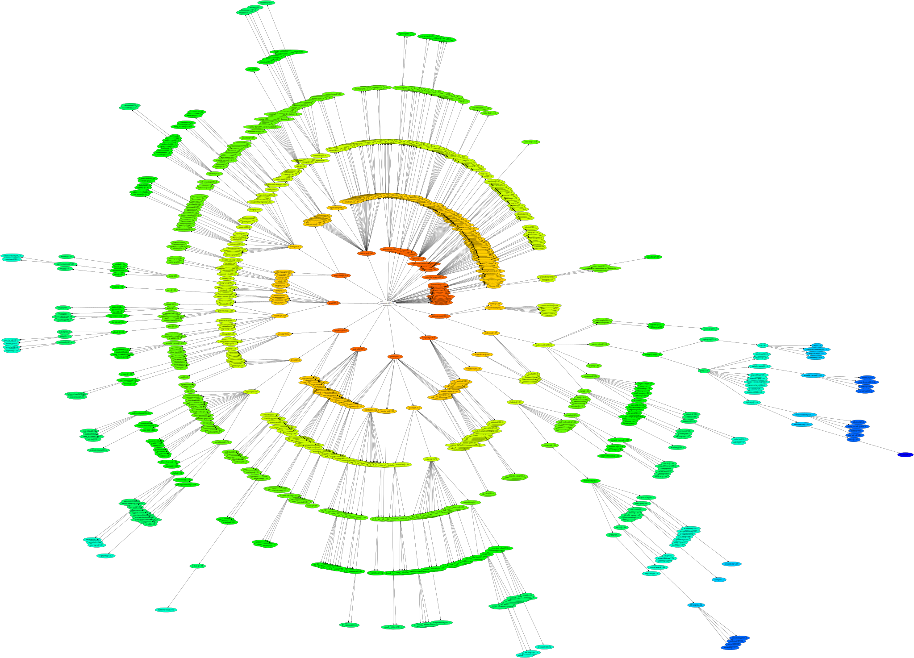
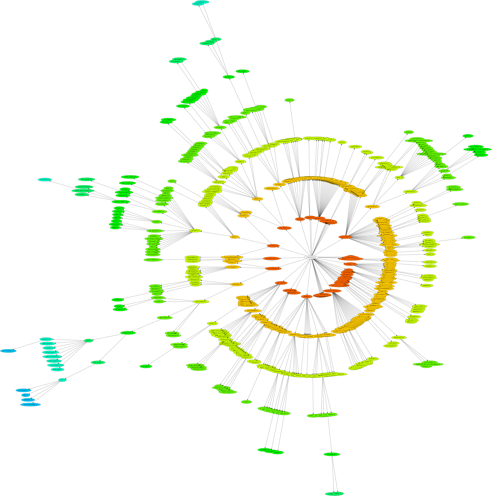

# npm2dot

[](https://travis-ci.org/wyvernnot/npm2dot)

Convert npm dependency list to dot file which can be visualized using graphviz

[](https://nodei.co/npm/npm2dot/)

# Install from NPM
```sh
npm isntall npm2dot -g
```

## Sample Usage

```sh
npm ls --json | npm2dot | dot -Tsvg -o /tmp/dot.svg -Grankdir=LR 
```

```sh
npm ls --json | npm2dot | twopi -Tsvg -o /tmp/twopi.svg -Granksep=4
```

## Example Output

npm@2


npm@3

