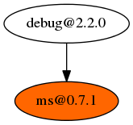
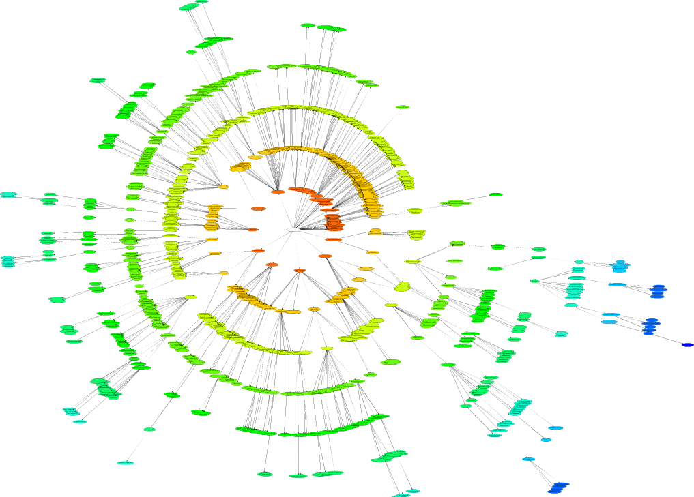
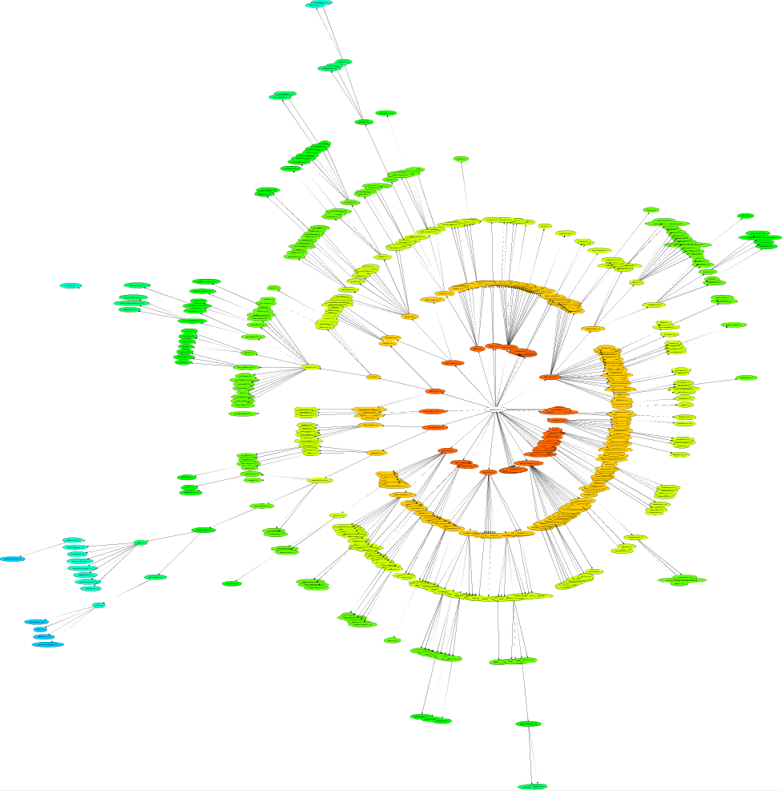
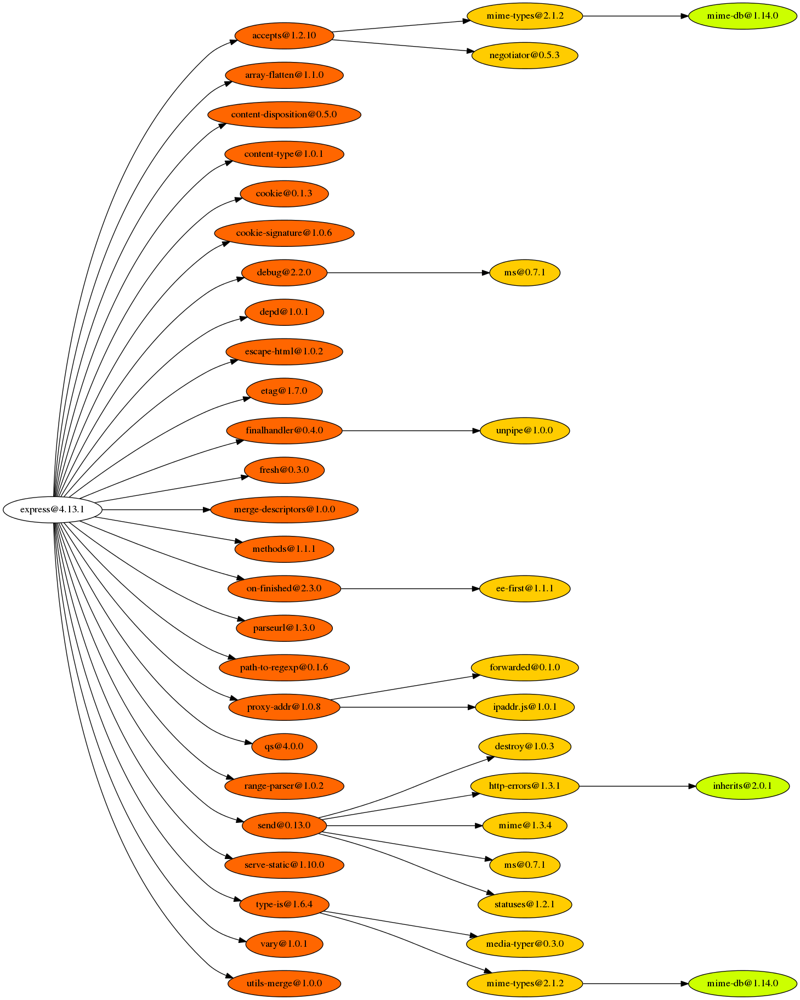
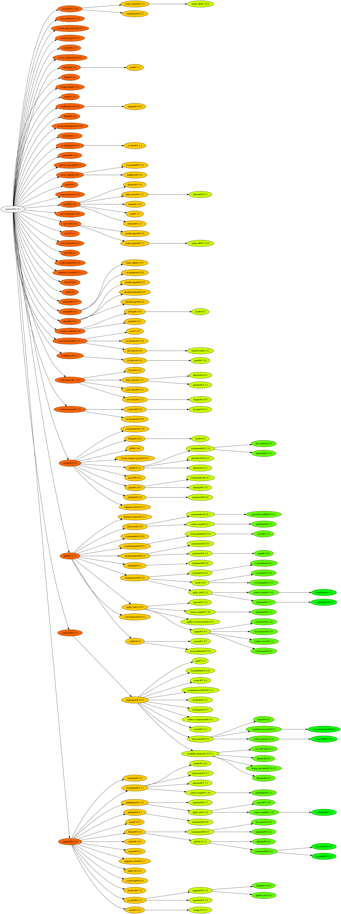

# npm2dot

[](https://travis-ci.org/longtian/npm2dot)

Convert npm dependency list to dot file which can be visualized using graphviz

[](https://nodei.co/npm/npm2dot/)

**Install**

```sh
npm install npm2dot -g
```

**Usage**

1\. In a `Node.js` package folder, type in console:

```sh
npm ls --json | npm2dot
```

2\. By default `npm2dot` will write following content to stdout:

```
digraph{
 root="debug@2.2.0"
 "debug@2.2.0" -> "N_1"
 "N_1"[label="ms@0.7.1",style="filled",fillcolor="0.06666666666666667 1 1"]
}
```

3\. This output can be piped to `Graphviz` to generate a picture:

```sh
npm ls --json | npm2dot | dot -Tpng -o debug.png -Grankdir=LR
```

Picture `debug.png` is very simple because [`debug`](https://www.npmjs.com/package/debug) has only one dependency:



That's how `npm2dot` interacts with `npm ls` and `Graphviz`. More complicated use cases are:

## Use Case 1 : Comparison of folder structure installed separately using NPM2 and NPM3

NPM3 is currently in beta, one of the most expected feature is [flatten structure](http://www.infoq.com/news/2015/06/npm) :

> Dependencies will now be installed maximally flat. Insofar as is possible, all of your dependencies,
> and their dependencies, and THEIR dependencies will be installed in your project's node_modules folder with no nesting. 
> You'll only see modules nested underneath one another when two (or more) modules have conflicting dependencies.

Using `npm2dot` and `Graphviz` will help you clearly understand this change:

```sh
npm ls --json | npm2dot | twopi -Tsvg -o /tmp/twopi.svg -Granksep=4
```

**Result:**

Before, the dependencies is install with npm@2.x



If we use npm@3.x (`npm install npm@3.x-next -g`) to install dependencies, there are less nodes in the structure



## Use Case 2 : Comparison of Express Production and Development environment

In express folder, execute

```sh
npm ls --json | npm2dot | dot -Grankdir=LR -Tpng -O
```

**Result:**

Express Production Environment



Express Development Environment



## About

1\. `Graphviz` can be downloaded at [http://www.graphviz.org/Download.php](http://www.graphviz.org/Download.php).

2\. Anyone can fork this repo to provide more interesting use cases.

3\. Please include a link to original [github repo](https://github.com/longtian/npm2dot), if you want to use any pictures on this page.


